Eamon Murphy - March 26th, 2026

This is a write up of my experience with the final lab in ImmersiveLab's Microsoft Sentinel Blue Team Ops lab series. Throughout this series, I practiced the fundamental skills required to provide security utilizing Microsoft Sentinel, such as alert and incident analysis, KQL querying, cyber threat intelligence management, analytical rule management, and more. The final lab, titled "Microsoft Sentinel Blue Team Ops: Demonstrate Your Skills", is rated at a difficulty level of 6/9 by ImmersiveLabs, and acts as a comprehensive challenge of all the skills acquired in the series.

I begin by taking notes on the lab briefing. To summarize the scenario of the lab, in this lab, I act as a security engineer for a company called Metrolio, and I must secure the organization's Microsoft Azure platform. I will have to disable a security rule generating too many false positives, import threat indicators using the free Threat Intelligence solution, manually import a separate list of IP Threat Indicators, add security coverage for the MITRE technique Account Manipulation \[T1098], and add a watchlist of employees that recently left the company.

The first task is to disable the security rule ‘Failed Windows Logins’. I first navigate to the Microsoft Sentinel Analytics blade, and find the rule. From there, it can be disabled by selecting the rule, clicking the ellipsis button on the command bar, and then clicking 'disable'.

Once the rule is disabled, I can move onto the next task. I am next instructed to add an analytics rule for that MITRE technique. I search for the technique in the Sentinel Analytics Rule Templates tab using a filter for the technique T1098.

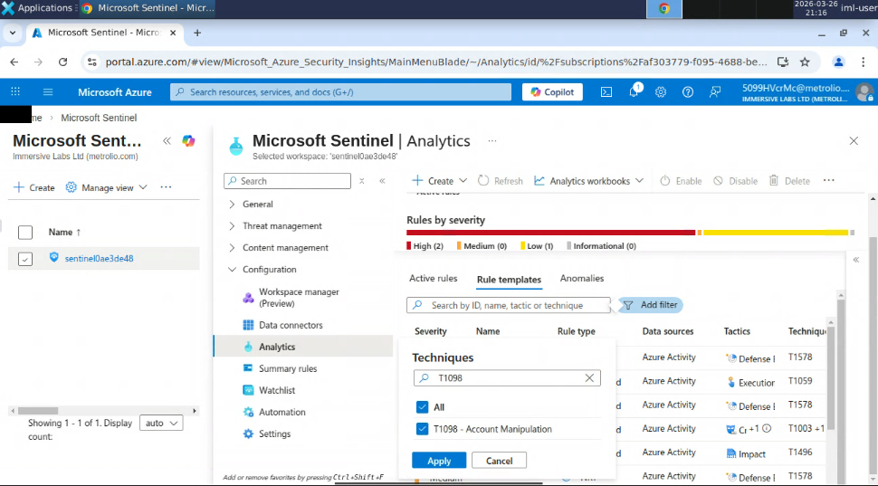

There are two rules available with this filter, but checking the tactics column displays only one is designed to handle a persistence tactic, so I create the rule using that one.

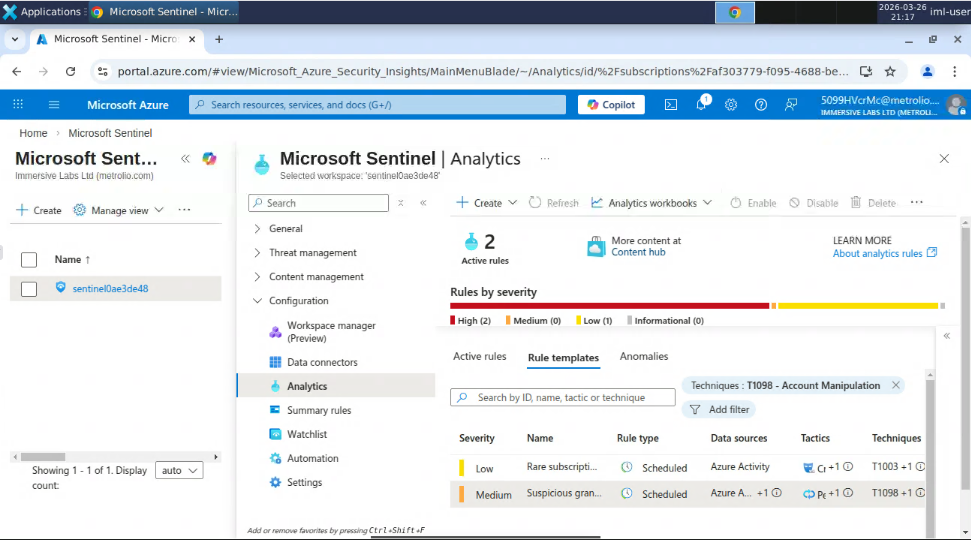

The lab instructs that I leave all values at their default, so I click through to the review and create page. This rule can create an alert if it detects that a user at an unknown IP starts granting permissions, so this should help with the concern of coverage for account manipulation attacks.

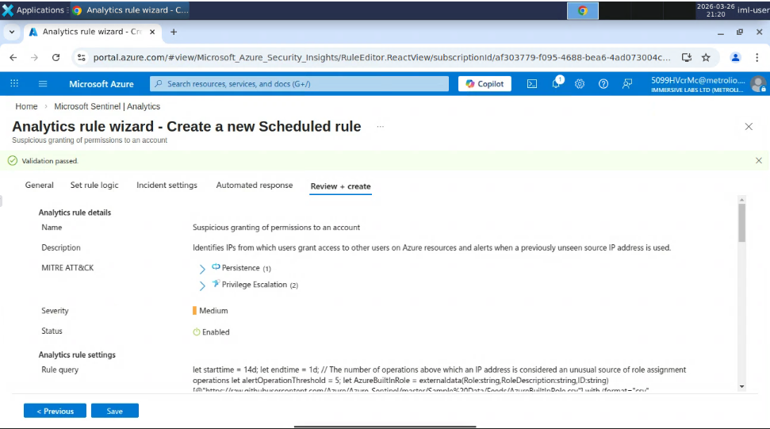

After this stage is complete, I can move onto the next task, which first instructs me to install Microsoft's Threat Intelligence solution. To do this, I navigate to the Content Hub blade, and search for it.

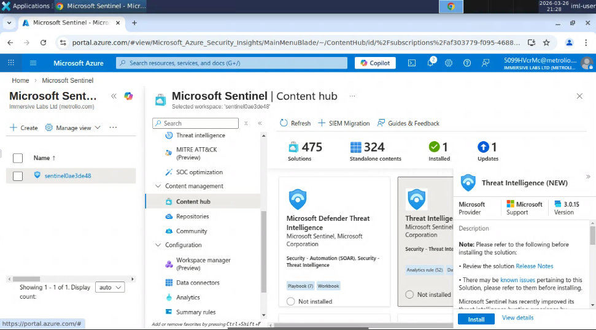

From there, it's a one click install, allowing me to move onto the next task. Now I must configure the Microsoft Defender Threat Intelligence Data Connector so the threat intel provided by the Threat Intelligence solution can be accessed for threat detection. I navigate to the Data Connectors blade and open the Microsoft Defender Threat Intelligence Data Connector page.

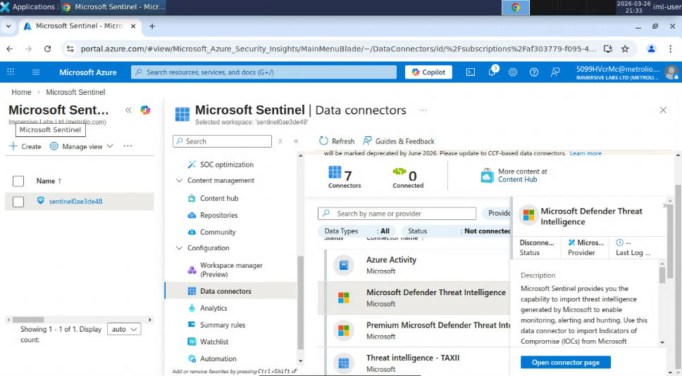

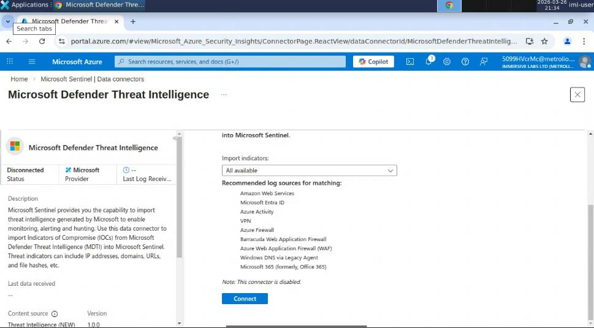

From here, this is another single click setup. One of the benefits I’m noticing with Microsoft Sentinel at this point is that, despite looking very confusing, once you know the ropes of the platform, configuring anything is fairly simple and quick. The instructions tell me to change the imported indicators from 'All available' to 'At most one day old', so I change that configuration and click connect, completing the task.

The next task instructs me to make a scheduled analytics rule from the Microsoft Defender Threat Intelligence Analytics Rule Template. I navigate back to Analytics Rule Templates, and search for the rule.

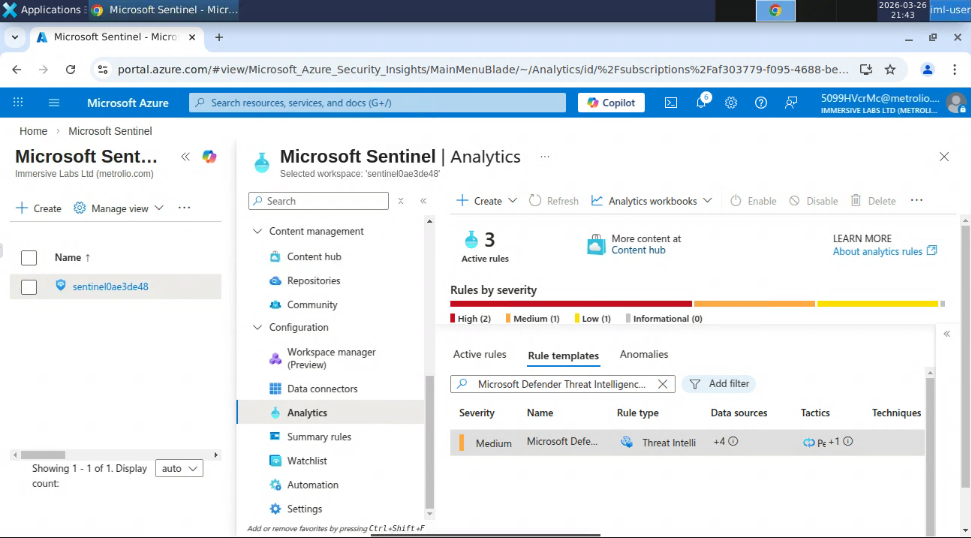

Just like before, this is a quick install with default settings, so I won't go into too much detail. This rule will create an alert if any Microsoft Defender Threat Intelligence Indicator matches with an event, making use of those new Threat Indicators. The next step instructs me to import that list of IP threats mentioned in the briefing. So, I navigate to the Threat Intelligence blade to use the import tool in the command bar.

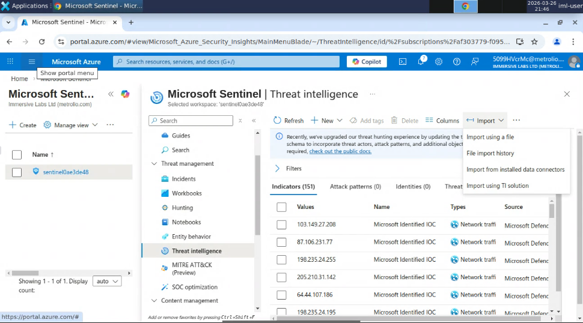

Clicking import using a file brings up the following window, in which I upload the provided file of malicious IP threat indicators. I am also instructed to set the source to MTI, so I do that as well.

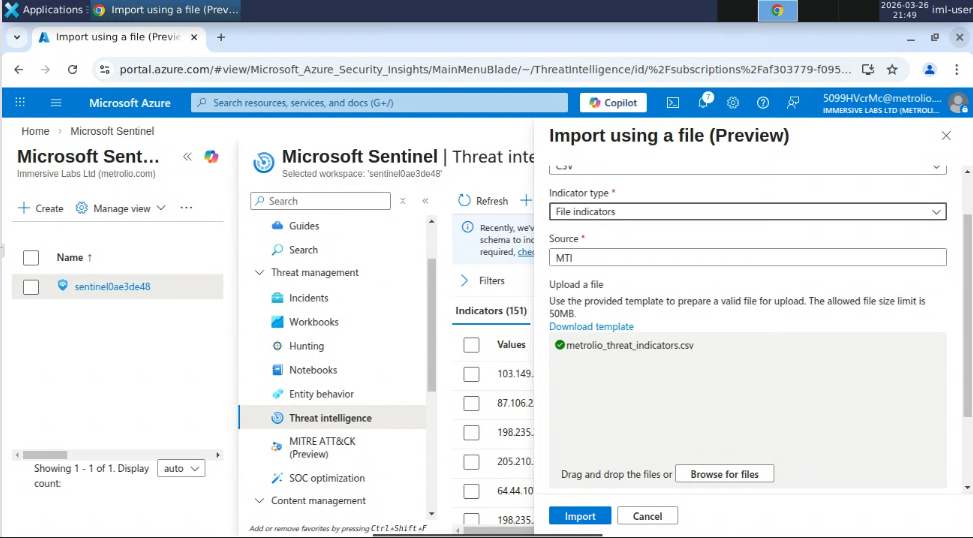

I then click 'Import', completing the task. The next task is making a watchlist from the provided file, which contains account info of terminated employees. I navigate to the watchlist pane and click new to begin creating the watchlist.

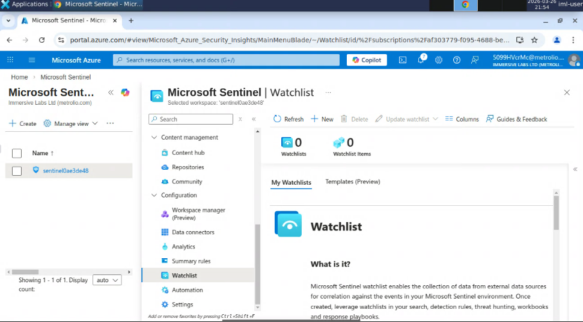
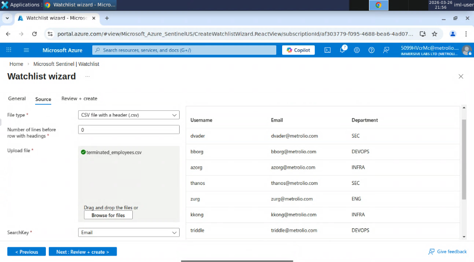

I upload the provided list of terminated employees, and set the SearchKey to email, as instructed. Clicking through review & create completes the task. My next task is to handle an incident. Navigating to the Incidents pane, I select incident 6 arbitrarily. I then assign the incident to myself, and change the status to active.

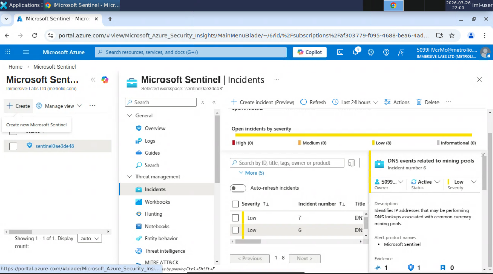

Next, I'm instructed to investigate the incident timeline to find the domain name which triggered the incident. I scroll down to the 'View full details' button and click it to open the incident timeline. Clicking on the alert in the timeline reveals the domain name was 'monerohash.com'.

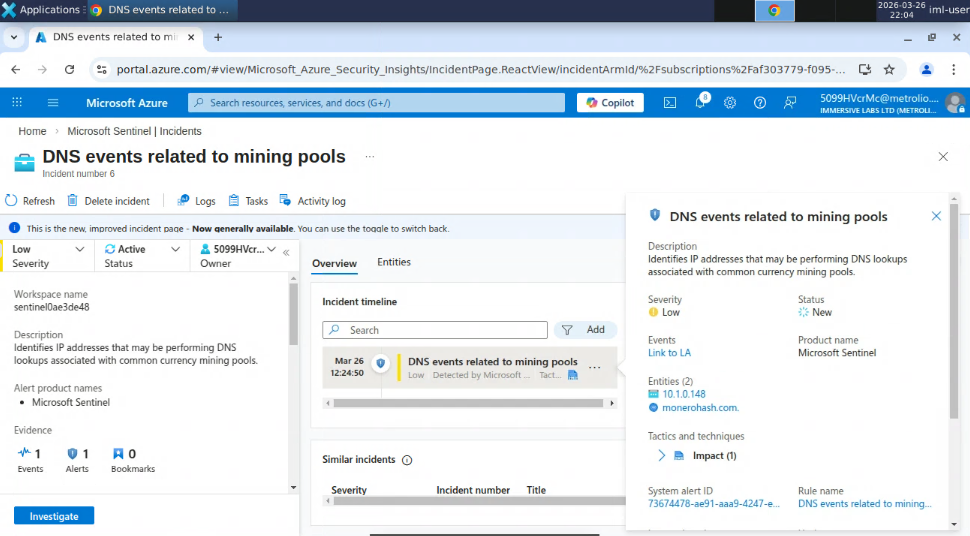

I answer the question for this task with the domain name, which moves me onto the next task, asking for the IP of the machine that may have a crypto miner installed. This IP is listed right above the domain name, so I use that IP to answer this question, completing the task. The final task asks for the start date and time of the crypto mining event. I click on the IP to bring up the entity page of the IP, and click 'View full details' to see more information. This brings up a timeline of events associated with the IP, and I scroll to the bottom to find the earliest event.

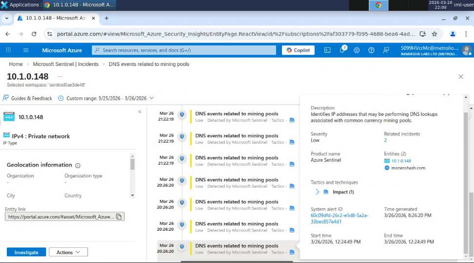

This reveals a start date and time of 3/26/2026 at 12:24:49PM, which I input, finishing the lab.
